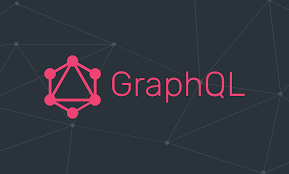

# Aurelio

**GraphQL** é uma linguagem de consulta criada pelo Facebook em 2012 e lançada publicamente em 2015. É considerada uma _alternativa para arquiteturas REST_, além de oferecer um serviço runtime para rodar comandos e consumir uma API.

Em 7 de novembro de 2018, o projeto GraphQL foi movido do Facebook para a recém-criada GraphQL Foundation, hospedada pela Linux Foundation, sem fins lucrativos. Desde 2012, a ascensão do GraphQL seguiu de perto o cronograma de adoção estabelecido por Lee Byron, criador do GraphQL.

O GraphQL fornece uma abordagem para o desenvolvimento de APIs da Web e foi comparado e contrastado com REST e outras arquiteturas de serviços da web. Ele permite que os clientes definam a estrutura dos dados necessários, e a mesma estrutura dos dados é retornada do servidor, evitando assim que um excesso de dados seja retornado, com implicações na eficácia do armazenamento em cache da Web dos resultados da consulta. A flexibilidade e a riqueza da linguagem de consulta também adicionam complexidade que pode não valer a pena para APIs simples.

O GraphQL consiste em um sistema de tipos, linguagem de consulta e semântica de execução, validação estática e introspecção de tipos . Ele suporta leitura, gravação (mutação) e assinatura de alterações nos dados (atualizações em tempo real – mais comumente implementadas usando WebSockets ).Os servidores GraphQL estão disponíveis para vários idiomas, incluindo Haskell, JavaScript, Perl, Python, Ruby, Java, C++, C#, Scala, Go, Rust, Elixir, Erlang, PHP, R, D e Clojure. O resultado de uma única consulta é retornado no formato JSON.

## Referencias

- [Introduction to GraphQL](https://graphql.org/learn/)
- [How to GraphQL](https://www.howtographql.com/basics/0-introduction/)